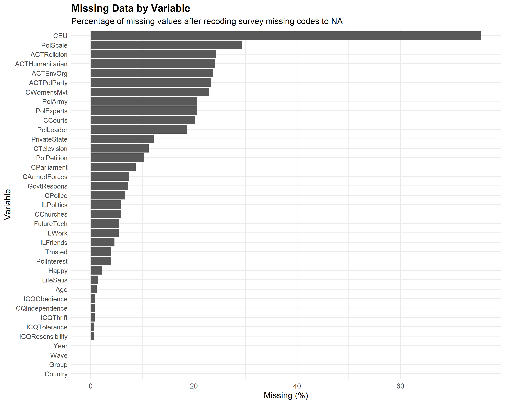
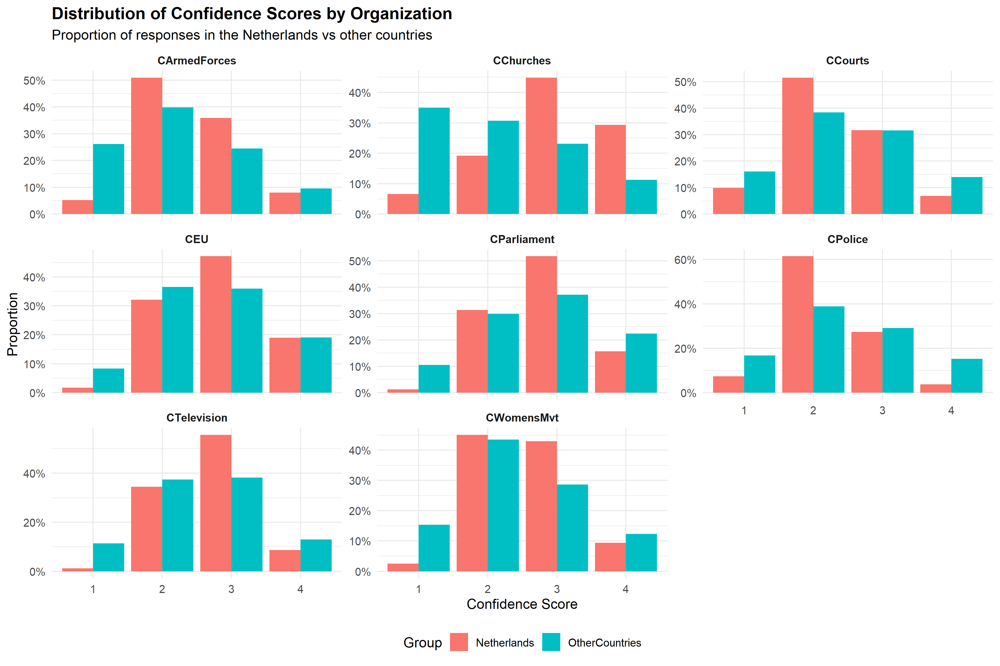
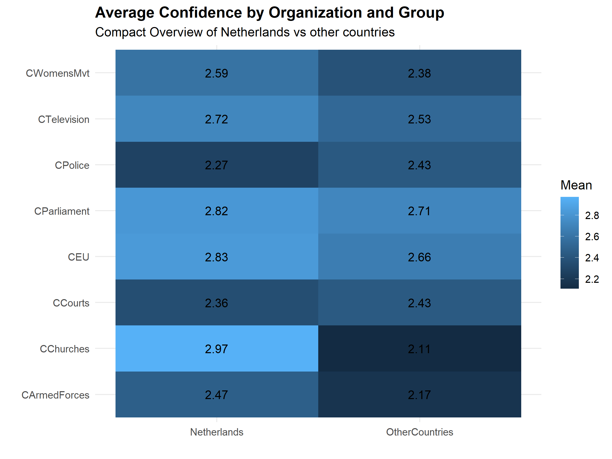
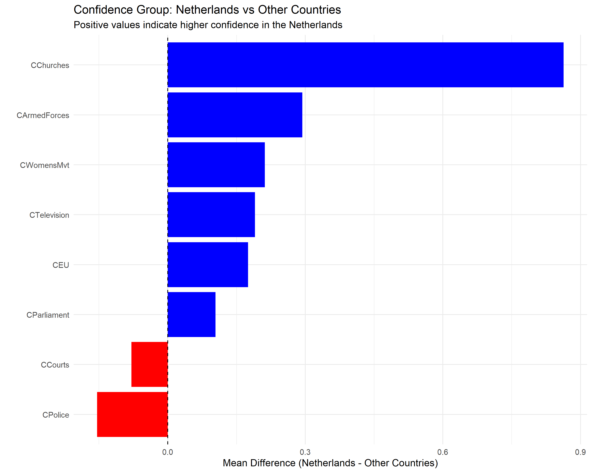
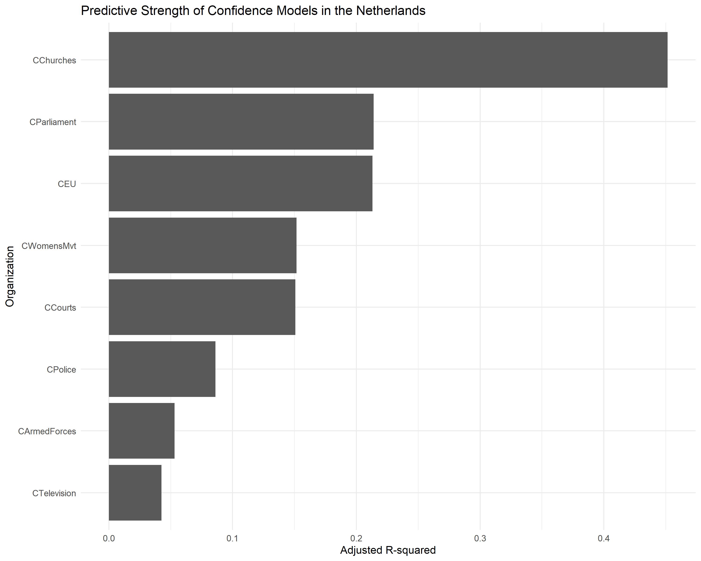
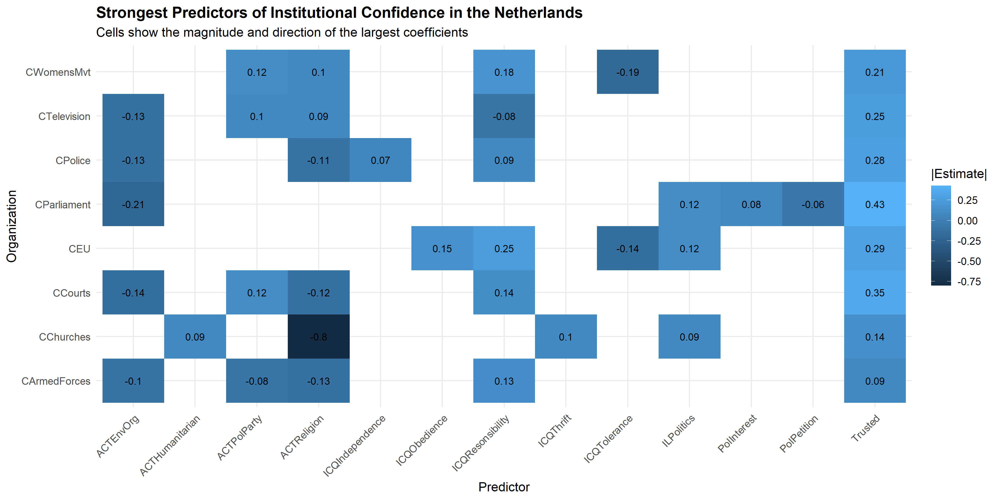
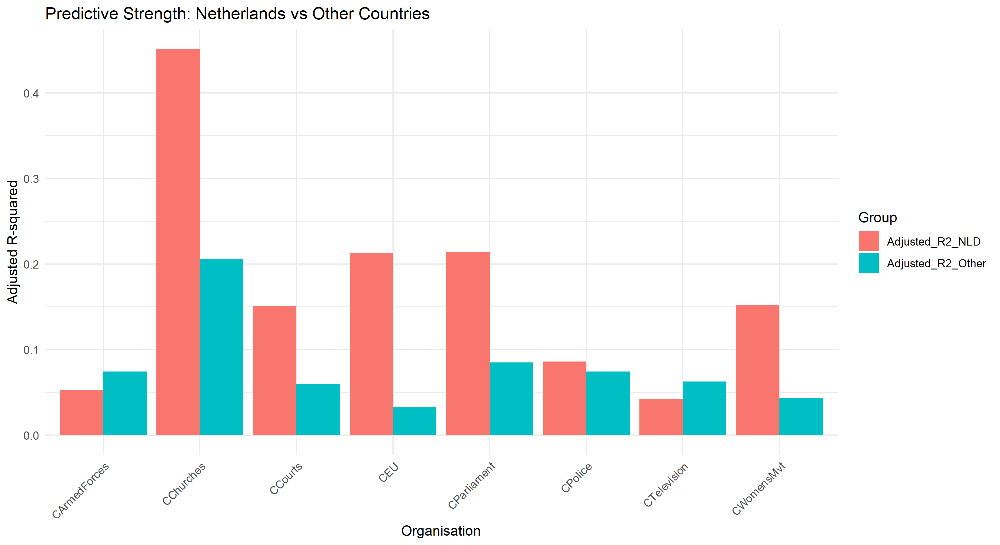
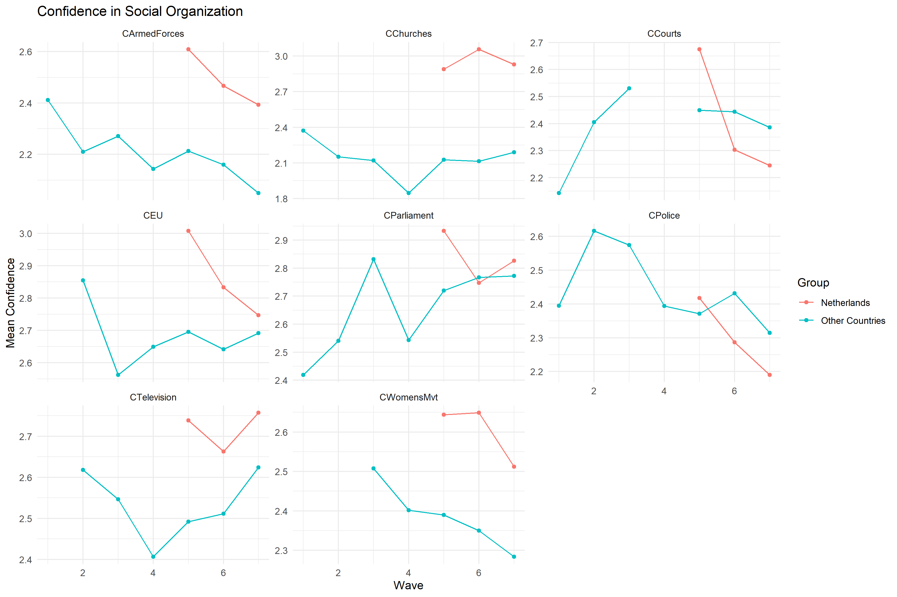
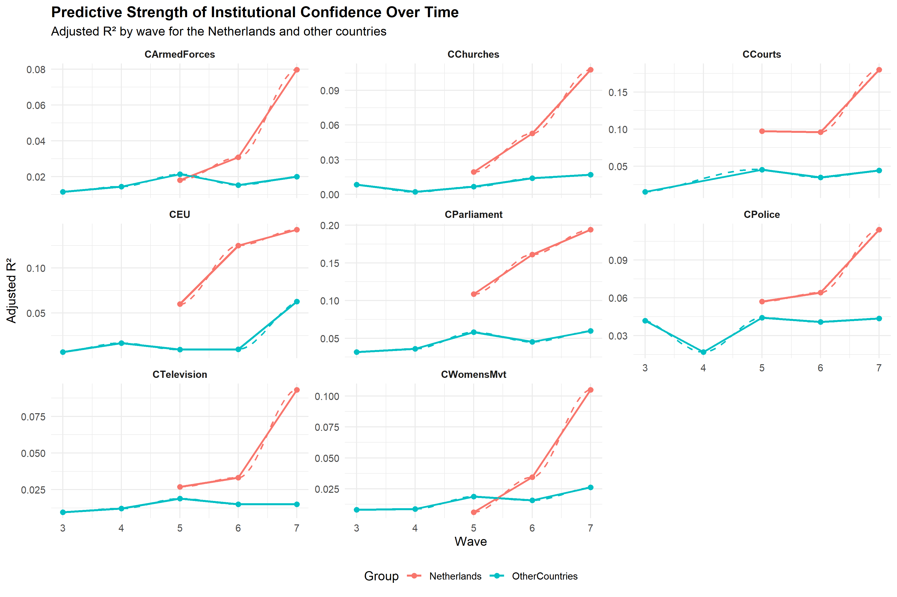
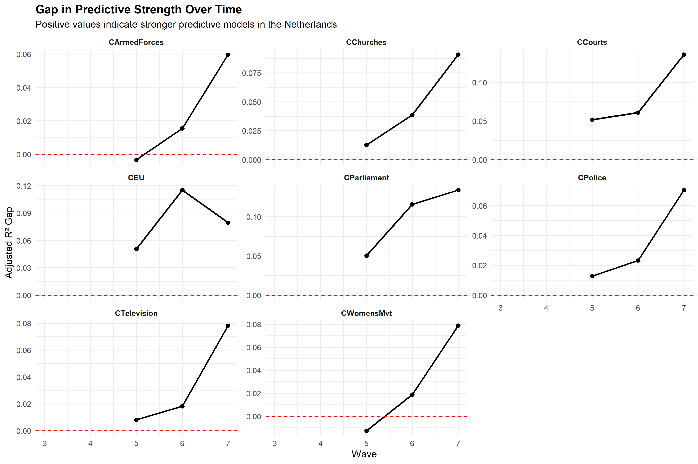

```{r}
knitr::opts_chunk$set(
  echo = FALSE,
  warning = FALSE,
  message = FALSE,
  fig.align = "center",
  out.width = "92%"
)

library(knitr)
library(dplyr)
library(tidyr)
library(ggplot2)
```
**INTRODUCTION**

This report analyses a reduced World Values Survey dataset to investigate how participant attributes predict confidence in social organisations, with a specific focus on the Netherlands.
The report therefore addresses three main tasks: descriptive analysis of the dataset, cross-sectional comparison of the Netherlands with all other countries as a pooled group, 
and time-based analysis across survey waves.

The focus country used throughout this report is the Netherlands (NLD). Confidence variables are identified by the prefix C, while the remaining selected variables are treated as potential predictors.
The analysis was conducted in R using descriptive statistics, comparative graphics, and regression modelling. Where relevant, assumptions and design decisions are explicitly stated.

**DATA AND METHOD**

*Dataset Construction*

An individual dataset was created from ```WVSExtract.csv``` by sampling 100,000 rows and selecting a subset of variables using a fixed random seed based on the student number. 
The dataset includes the core fields Wave, Country, and Year, alongside a sampled set of predictor variables and a sampled set of confidence variables.

A key part of the data-generation process was reproducibility. The sampling was performed using a fixed seed linked to the student number so that the same dataset can be recreated if needed.
```{r}
set.seed(34674896)

VCData <- read.csv("data/raw/WVSExtract.csv")

VC <- VCData[sample(1:nrow(VCData), 100000 , replace = FALSE), ]
VC <- VC[, c(
    1:3,
    sort(sample(4:50, 25, replace = FALSE)),
    sort(sample(51:65, 8, replace = FALSE))
)]

write.csv(VC, "data/processed/FIT3152A1Data_AlinMerchant.csv", row.names = FALSE)

# Adding Focus-Country group
VC$Group <- ifelse(VC$Country == "NLD", "Netherlands", "OtherCountries")
VC$Group <- as.factor(VC$Group)
```

*Variable Groups*

The final sampled dataset contains two main types of analytical variables:

- **Confidence variables**, identified by the prefix C, representing confidence in institutions such as churches, armed forces, police, parliament, television, courts, women’s movements, 
  and the European Union.

- **Predictor variables**, representing social values, life attitudes, political orientations, trust, and demographic factors such as age.

*Data Cleaning and Assumptions*

Several preprocessing steps were applied before analysis. Survey-specific missing-value codes were recoded to *NA*, variables with no usable variation were excluded where necessary, and regression models were estimated using complete cases. 
These choices were made to improve model stability and ensure meaningful statistical comparison.
```{r}
num_cols <- names(VC)[sapply(VC, is.numeric)]
VC_clean <- VC

for (col in num_cols) {
  VC_clean[[col]][VC_clean[[col]] %in% c(-1, -2, -4, -5)] <- NA
}
```
The main assumptions used throughout the report are:

- Ordinal survey responses can be treated as numerical.

- Complete-case analysis is acceptable for regression modelling given the observed pattern of missingness.

- For Question 3(b), a reduced predictor set is justified because the sample becomes smaller once the data are split by both country group and wave.

**QUESTION 1: DESCRIPTIVE ANALYSIS**

*Overall Structure of the data*

The sampled dataset contains approximately 100,000 observations and a mixture of temporal, categorical, and numerical variables. *Wave*, *Country*, and *Year* define the survey context, while the remaining variables represent individual responses about social values, 
institutional confidence, and political or personal attitudes.

The confidence variables are all measured on bounded ordinal scales. These scales are not continuous in a strict statistical sense, but they are sufficiently structured to support summary comparison and regression-based modelling. From an analytical prespective, 
the dataset is rich enough to support both cross-sectional and longitudinal comparison, which is important because later sections of the report require both.

*Missing data and Preprocessing*

A major feature of the dataset is the uneven distribution of missing values across variables. Some variables contain very little missingness, while others show considerably higher proportions. This matters because missing values reduce the number of observations available for 
complete-case modelling and can affect the comparability of institutions and predictors.
```{r}

```
**Interpretation:** Figure 1 shows that missingness is concentrated in a relatively small number of variables rather than being evenly spread across the dataset. In particular, variables such as *CEU* and *PolScale* show relatively high missing proportions, while variables such as *Country*, *Wave*, *Year*, 
                    and several demographic or child-quality variables contain little or no missingness. This suggests that the analytical difficulty of the dataset is driven more by selected attitudinal variables than by basic identifiers.

**Graphic design resoning:** A horizontal missingness bar chart was chosen because it allows quick ranking of variables from highest to lowest missingness. This makes the data-quality structure of the dataset immediately visible and supports later methodological choices, particularly the use of complete-case regression.

*Distribution of confidence responses*

The confidence variables display discrete and bounded response distributions, which is expected for survey-based institutional confidence measures. Most responses fall in the middle of the confidence scale rather than at the extremes.
```{r}

```
**Interpretation:** Figure 2 shows that institutional confidence is generally concentrated in the middle of the scale, particularly at scores 2 and 3. This indicates that respondents are more likely to express moderate than extreme confidence. The comparison between the Netherlands and other countries also suggests that the two groups 
                    differ not only in their averages, but in their full response compositions.

Overall, the descriptive analysis shows that the dataset is suitable for the task but requires deliberate handling of missing data and ordinal response scales. The data are broad enough to support meaningful cross-country comparison, and the visible differences in response distributions justify more detailed modelling in later sections.

**QUESTION 2: FOCUS COUNTRY VS ALL OTHER COUNTRY AS A GROUP (INDEPENDENT OF TIME)**

*2(a) How Participant responses differ in the Netherlands*

To answer this, all observations were pooled across waves and then grouped as either *Netherlands* or *OtherCountries*. Institutional confidence was then compared using both averages and full score compositions.
```{r}

```
**Interpretation:** Figure 3 shows that the Netherlands does not differ uniformly from the pooled international sample. Instead, the difference varies by organisation. In the current analysis, the Netherlands shows clearly higher average confidence in *churches*, *parliament*, *the European Union*, *the women’s movement*, *television*, and the *armed forces*. 
                    In contrast, confidence in *police* and *courts* is slightly lower than in the pooled international group. This indicates that institutional confidence is organisation-specific rather than a single general attitude.

```{r}

```
**Interpretation:** Figure 4 makes the group differences clearer by focusing directly on the gap between the Netherlands and other countries for each institution. The largest positive gap appears for churches, followed by the armed forces and the women’s movement. Police and courts, by contrast, show negative or near-zero gaps. This suggests that institutional trust in the Netherlands is selective: 
                    it is not simply “higher” overall, but higher in some domains and lower in others.

*2(b) How well Participant attributes predict confidence in the Netherlands*

To answer this, separate regression models were fitted for each confidence variable using the sampled predictor set, and model quality was compared using adjusted R-squared.
```{r}

```
**Interpretation:** Figure 5 shows substantial variation in predictive strength across institutions. Confidence in churches is by far the most predictable outcome in the Netherlands, with a much larger adjusted R-squared than the other institutions. Parliament and the European Union also show moderate predictive strength, while armed forces and television are relatively weakly explained by the selected attributes. 
                    This indicates that the predictor set captures some forms of institutional confidence much better than others.

```{r}

```
**Interpretation:** Figure 6 identifies the strongest model coefficients across Dutch institutional models. A repeated pattern is the importance of general trust, life satisfaction, and selected political or membership-related variables. Trust appears particularly prominent, suggesting that confidence in institutions is closely linked to broader interpersonal or social trust. At the same time, the strongest predictors differ across institutions, 
                    implying that confidence in churches, parliament, courts, and police is shaped by partly different mechanisms.

**Graphic design reasoning:** A coefficient heatmap was chosen because it allows multiple models and multiple predictors to be compared at once.

Overall, the Netherlands models show that institutional confidence is not equally predictable across all organisations. Some institutions are strongly tied to participant attitudes and values, while others appear to depend on factors outside the selected predictor set.

*2(c) Comparison with other countries*

This repeats the modelling exercise for all other countries treated as a pooled group and asks how the results compare with the Netherlands. The same modelling framework was applied to the international group so that predictive strength could be compared directly.
```{r}

```
**Interpretation:** Figure 7 shows that the relative predictability of institutional confidence differs across groups. In several cases, the Netherlands produces stronger models than the pooled international sample, particularly for churches, parliament, the European Union, and the women’s movement. In contrast, other countries perform slightly better for only a smaller number of institutions, such as armed forces or television. 
                    This suggests that the same predictor set does not explain confidence equally well in all national contexts.

**Graphic design reasoning:** A side-by-side comparison chart was used because the main aim here is to compare the predictive quality of the two groups institution by institution. The chart directly supports the required discussion of similarities and differences between the Netherlands and other countries.

The broader interpretation is that institutional trust is context-dependent. Even when the same survey variables are available, their explanatory power changes across national settings. This is consistent with the idea that public confidence is shaped partly by institutional history, social norms, and national political culture.

**QUESTION 3: FOCUS COUNTRY VS ALL OTHER COUNTRIES AS A GROUP (OVER TIME)**

*3(a) How participant responses over time*

This question asks how participant responses vary over time in the focus country and in the pooled international group, and asks for a graphic that supports comparison of the most interesting results over time. In this report, wave rather than year was used because it provides a clearer and more stable basis for comparing survey responses across the available data.
```{r}

```
**Interpretation:** Figure 8 shows that institutional confidence does not evolve uniformly across organisations. Some institutions display relatively stable confidence patterns across waves, while others show more noticeable increases or decreases. The Netherlands often remains above the pooled international sample, but not for every institution and not by the same margin at every point in time. This indicates that the effect of national context persists over time, 
                    though its size varies by organisation.

**Graphic design reasoning:** A faceted trend plot was selected because it allows within-organisation trends and between-group differences to be compared simultaneously. This supports the requirement to compare focus and other countries over time in a single interpretable visual.

The most important conclusion from Question 3(a) is that time matters. The relationship between national context and institutional trust is not fixed across the survey period. Some institutions remain stably distinct, while others become more similar or more divergent across waves.

*3(b) How predictive ability changes over time*

This question asks how the ability of participant attributes to predict institutional confidence changes over time, whether the important predictors change, and how these time-based patterns compare between the Netherlands and other countries.
To maintain sufficient complete cases, a reduced predictor set was used for these models. This decision was made to improve model stability and is justified by the smaller sample sizes available once the data are separated by country group and wave.
```{r}
# Reduced predictor set for wave-level modelling
q3b_predictors <- c(
  "Trusted",
  "LifeSatis",
  "GovtRespons",
  "PolExperts",
  "PolInterest",
  "Age"
)
```
```{r}

```
**Interpretation:** Figure 9 shows that model performance is not stable across waves. For some institutions, adjusted R-squared values remain relatively consistent, which suggests that the selected participant attributes explain institutional confidence in a broadly stable way. For other institutions, predictive strength rises or falls more noticeably, implying that the relationship between attitudes and institutional confidence changes over time.

**Graphic design reasoning:** A time-series model-performance plot was chosen because Question 3(b) is fundamentally about change over time in predictive quality. This design allows to see both temporal trajectory and group comparison in a single view.

```{r}

```
**Interpretation:** Figure 10 shows the difference in predictive strength between the Netherlands and other countries. Positive values indicate stronger models in the Netherlands. The gap is not constant. In some waves and for some institutions, the Netherlands is more predictable; in others, the pooled international group is equal or stronger. This demonstrates that model performance is shaped not only by institution and country group, but also by time.

**Graphic design reasoning:** This gap plot was chosen because plotting the difference directly increases information density and makes the cross-group comparison much easier to interpret than two seperate sets of lines.

**CONCLUSION**

This report analysed a reduced World Values Survey dataset to examine country-level differences in confidence in social organisations and the predictors of that confidence, with a focus on the Netherlands. The findings show that the Netherlands differs from other countries in institution-specific rather than uniform ways. It generally shows higher confidence in several organisations, particularly churches, parliament, the European Union, and the women’s movement, 
while showing smaller or negative differences for police and courts.

The modelling results demonstrate that some institutions are more predictable than others. In the Netherlands, confidence in churches is especially well explained by the selected attributes, while confidence in television and the armed forces is less predictable. General trust, life satisfaction, and selected political attitudes emerge as important predictors, but their importance varies across institutions.

The time-based analysis adds a further layer of complexity. Both institutional confidence and model performance change across waves, and the Dutch pattern does not simply mirror the pooled international pattern. This shows that institutional trust is shaped jointly by individual attitudes, national context, and temporal change.

Taken together, the results support the assignment’s central claim that predictors of institutional confidence differ across countries and evolve over time. A key limitation is that missing data and reduced wave-specific sample sizes constrain some comparisons, especially in Question 3(b). Even so, the overall evidence is strong enough to support meaningful conclusions about institutional trust in the Netherlands relative to other countries.

Appendix: Key code extracts

*A1: Cross-sectional modelling function*
```{r}
fit_models <- function(data, confidence_vars, predictor_vars) {
  results <- list()

  for (cv in confidence_vars) {
    formula_text <- paste(cv, "~", paste(predictor_vars, collapse = " + "))
    model <- lm(as.formula(formula_text), data = data)

    results[[cv]] <- list(
      model = model,
      adj_r2 = summary(model)$adj.r.squared,
      r2 = summary(model)$r.squared,
      coeffs = summary(model)$coefficients
    )
  }

  results
}
```

*A2: Time-based modelling function*
```{r}
fit_models_by_wave <- function(data, confidence_vars, predictor_vars, min_rows = 20) {
  waves <- sort(unique(na.omit(data$Wave)))
  out <- data.frame()

  for (w in waves) {
    dw <- data[data$Wave == w, , drop = FALSE]

    for (cv in confidence_vars) {
      preds <- setdiff(predictor_vars, cv)
      needed_cols <- c("Wave", cv, preds)
      model_df <- dw[, needed_cols, drop = FALSE]
      model_df <- na.omit(model_df)

      if (nrow(model_df) < min_rows) next

      varying_preds <- preds[sapply(model_df[, preds, drop = FALSE], function(x) {
        length(unique(x)) > 1
      })]

      if (length(varying_preds) == 0) next

      formula_text <- paste(cv, "~", paste(varying_preds, collapse = " + "))
      model <- lm(as.formula(formula_text), data = model_df)
      sm <- summary(model)

      out <- rbind(out, data.frame(
        Wave = w,
        Organisation = cv,
        Adjusted_R2 = sm$adj.r.squared,
        R2 = sm$r.squared,
        N = nrow(model_df),
        Predictors_Used = length(varying_preds)
      ))
    }
  }

  out
}
```