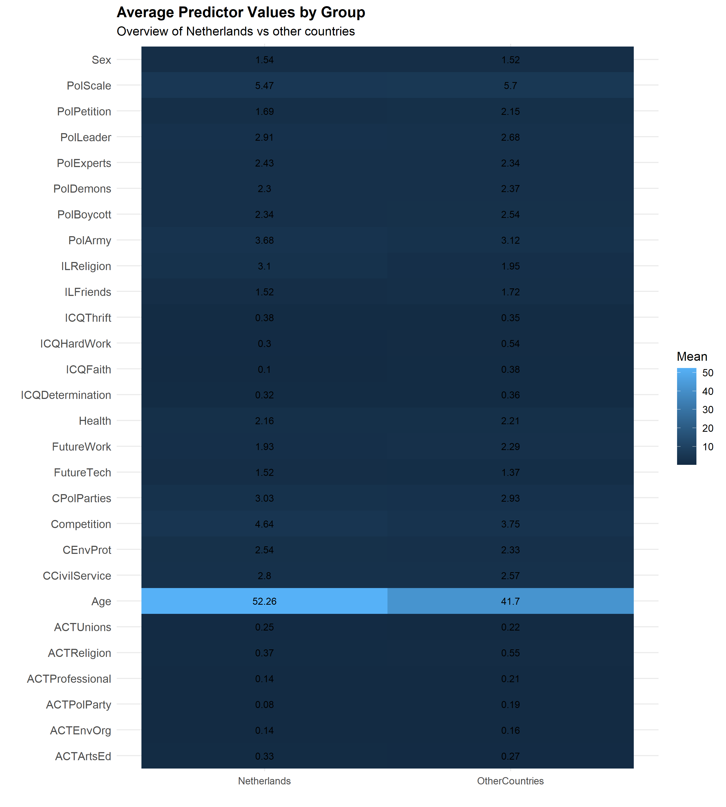

knitr::opts_chunk$set(
  echo = FALSE,
  warning = FALSE,
  message = FALSE,
  fig.align = "center",
  out.width = "92%"
)

library(knitr)
library(dplyr)
library(tidyr)
library(ggplot2)

Introduction
This report analyses a reduced World Values Survey dataset to investigate how participant attributes predict confidence in social organizations,
with a specific focus on the Netherlands. The report is organized question by question. Section 1 provides a descriptive overview of the data. Section 2
compares the Netherlands with other countries as a single pooled group and evaluates how well participant attributes predict confidence in institutions.
Section 3 introduces the effect of time and examines whether both institutional confidence and its predictors change across waves.

Question 1: Descriptive Analysis

Dataset Overview
The dataset used in this analysis consists of approximately 100,000 observations sampled from the World Values Survey across Waves 1 to 7 (1981-2022).
It includes a mixture of numerical and categorical variables representing participant demographics, attitude, values, and confidence in social organizations.

The dataset contains:
- Temporal Variables: Wave and Year
- Categorical Variables: Country
- Numerical Predictors: e.g., Age, Happiness, Trust, political attitudes
- Target Variables: Confidence indicators (prefixed with "C"), such as CPolice, CParliament, and CChurches

All confidence variables are measured on ordinal scales, which are treated as numerical for the purpose of this analysis.

Data Cleaning
Several preprocessing steps were applied before analysis.
- Survey-specific missing-value codes such as negative placeholders were recorded to NA.
- Data types were standardised across variables.
- Variables with no usable observations or no variation were excluded where necessary.
- Regression models were estimated using complete cases for the variables included in each model
- Variables were grouped into "Netherlands" and "Other Countries" for comparative analysis.

Missing Data Analysis
A major feature of the dataset is the uneven distribution of missing values across variables. Some variables contain very little missing data, while
others have relatively substantial missingness.

knitr::include_graphics("outputs/figures/q1_missing_values.png")

Figure 1 shows that some variables, such as CEU and PolScale, exhibit relatively high proportions of missing values, while demographic variables contain
minimal missingness. The presence of missing data is significant because it can impact both descriptive statistics and predictive modelling. To ensure model
stability and consistency, missing values were handled by removing incomplete observations during regression analysis.

Distribution of Confidence Responses
The confidence variables generally show discrete, bounded response patterns rather than continuous distributions, which is expected for survey-based ordinal scales.
Responses tend to cluster around moderate values, with relativel fewer observations at the extreme

knitr::include_graphics("outputs/figures/q1_confidence_proportions.png")

Figure 2 indicates that institutional confidence is typically concentrated in the middle of the scale (2 or 3), rather than at the lowest or highest (1 or 4) values.
This suggests that respondants often express moderate rather than absolute levels of confidence.

Question 2: Focus Country vs all Other Countries as a Group (Independent of time)

2(a): How Participant responses differ in the Netherlands
This requires comparison of the focus country with all other countries while ignoring time. To address this, all observations were grouped into either Netherlands or OtherCountries,
and institutional confidence was summarised across the full pooled sample without seperating by wave or year. This provided a broad comparison of average
confidence levels and response distributions between the two groups.

knitr::include_graphics("outputs/figures/q1_confidence_heatmap.png")

Figure 3 shows that the Netherlands does not differ from other countries in a uniform way. Instead, the size and direction of the difference vary by organization.
In the current analysis, the Netherlands displays notably higher average confidence in institutions such as:
- Churches
- Parliament
- The Eurpean Union and
- The Women's Movement

While confidence in Police, and Courts is closer to or slightly below the pooled international average

knitr::include_graphics("outputs/figures/q2a_confidence_diff.png")

Figure 4 makes these differences more visible by showing the gap between the two groups for each institution. The largest positive gap appears for churches, followed by 
several institutional and supernational orgainzations, while police and courts show negative or near-zero gaps.

2(b): How well participant attributes predict confidence in the Netherlands
To answer this, seperate regression models were fitted for each confidence variable using the selected predictor variables. Model performance was then compared using 
adjusted R-squared values.

knitr::include_graphics("outputs/figures/q2b_nld_model_strength.png")

Figure 5 shows clear variation in predictive strength across institutions. Confidence in churches is the most predictable outcome in the Netherlands, with a substantially higher 
adjusted R-squared than the other institutions. Parliament and the European Union also show moderate predictive strength, while armed forces and television are less well 
explained by the selected predictors. This indicates that the explanatory value of the precitor set depends strongly on the institution being analysed.

Figure 6 identifies the strongest model coefficients across Dutch institutional models. A notable pattern is the repeated importance of variables such as general trust, 
life satisfaction, political attitudes, and selected membership or value variables. At the same time, the strongest predictors are not identical across institutions, which implies 
that condidence in churches, parliament, courts, and police is shaped by partly different mechanisms.

Overall, Question 2(b) shows that institutional confidence in the Netherlands is not equally predictable across all organizations. Some confidence outcomes are strongly linked to 
participant attitudes and values, while others appear to depend on additional factors not fully captured by the sampled predictor set.

2(c): Comparison with other countries
This repeats the modelling exercise for all other countries treated as one pooled group. The same modelling framework was applied to the international group so that the predictive strength 
and key predictors could be compared directly.

knitr::include_graphics("outputs/figures/q2c_r2_comparison.png")

Figure 7 shows that the relative predictability of institutional confidence differs across groups. In several cases, the Netherlands produces stronger models than the pooled international sample, 
especially for churches, parliament, the European Union, and the Women's movement. In contrast, other countries outperform the Netherlands for a smaller number of institutions, such as armed forces 
or television. This suggests that the same predictor does not explain confidence equally well in all other national contexts.

The substantive interpretation is that institutional trust is context-dependent. Even when the same survey attributes are available, their explanatory power changes across national settings. This 
is consistent with the idea that public confidence is shaped partly by national political culture, social norms, and institutional history.

Question 3: Focus Country vs all Other Countries as a Group (over time)

3(a)
